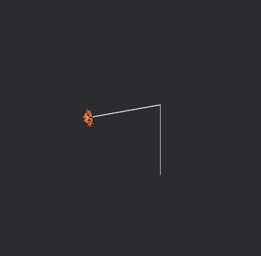

# Introduction

## This documentation will talk about the following

- [Information about the Application](#introduction-to-the-application)
- [The scripting API](#introduction-to-the-scripting-api)
  - [Utility functions](#utility-functions)
  - [Graphical functions](#graphical-functions)
  - [Interacting with the user](#interacting-with-the-user)
  - [Callbacks](#callbacks)

Examples will be show thorughout the documentation to help the reader.

### Introduction to the Application

Ferris Draw is a versatile, user-friendly application designed to help people get familiar with programming. More specifically, with the lua programming language.

The application strives to be a usable tool for all ages.

It is written in the Rust programming language, using bevy as it's game engine and Egui + Eframe for its GUI framework and library.

### Introduction to the User Interface

Before beginning production of the most beautiful drawings, one must know what they're working with.

**The next image depicts the main navigation bar of the application.**


- Blue (File): Opens up the file menu where the user can save and load their projects. All projects use the `.data` extenstion. These save files are serde serialized and compressed.
- Red (Toolbox): Opens up the toolbox menu where different parts of the ui can be enabled or disabled.
- Yellow (Documentation): Opens up the documentation window in the Application.

#### The different parts of the User Interface


- Yellow (Top Bar): This part is to control the main functionality of the Application and to customize the environment.
- Blue (Command Panel): You can enter commands in the Command Panel to execute them quickly, without having to write / create a new script. The user can see the input (what they've entered) and the output the Lua runtime returned. You can re-enter your input history via the Up and Down button. Commands can be sent with pressing Enter.
- Red (Item Manager): The item manager consists of different tabs all for displaying different information:
  - The `Entities` tab is used to display the currently available [Drawers](#drawers-tab).
  - The `Scripts` tab is used to display the currently existing [Scripts](#scripts-tab) and the deleted scripts in the rubbish bin.
- Green (Canvas): The canvas is where the user can draw freely. This part of the UI is managed purely by the bevy game engine.

## Important information about the Application

Before diving into the Scripting API, we need to get familiar with the Application's uniqueness.

### Drawers

Drawers are what allow the user to paint on the canvas. Every drawer has a unique identification (In a String format). Thats why one must pay attention when scripting with multiple drawers as it's important to know which drawer we would like to control. All drawers are controlled separately, and can have different positions, drawing colors, states.

**The Drawer's icon.**


### Drawers tab

The Drawers tab displays all currently alive Drawers. This includes their position, drawing color, state.


## Introduction to the Scripting API

Scripting in this Application is made possible by [mlua](https://github.com/mlua-rs/mlua), therefor it is running lua as it's programming language.
There will be examples to most of the functions listed. If an invalid drawer ID is provided the functions will all fail.

### Scripts tab

The scripting tab is depicted in the [GUI showcase](#the-different-parts-of-the-user-interface). Scripts can be edited and ran through the Application (Syntax highlighting is also avilable). They can aslo be renamed, and deleted (Deleted scripts can be restored from the rubbish bin).

### Utility functions

1. **`new(String)`**  
   Creates a new drawer object with the specified name.

2. **`center(String)`**  
   Centers the object identified by the given name.

3. **`wipe()`**
   Wipes all drawings from the workspace.

4. **`exists(String)`**
   Returns whether the drawer exists with that specific ID.

5. **`remove(String)`**
   Removes the drawer object based on the ID.

6. **`drawers()`**
   Returns a list of the drawers' name.

7. **`position(String)`**
   Returns the position of the drawer in (x, y) format.

**The example usage of these functions.**

```lua
-- If drawer1 doesnt exist then we should create one.
-- Drawer1 will show up in the Entities tab.
if not exists("drawer1") then
    new("drawer1")
end

-- This will return a list of the drawer's name
drawers() --Output: ["drawer1"]

--[[
    **Drawing with the drawer**
]]

-- Drawer1 will return to its original position (0, 0, 0).
center("drawer1")

-- Get the position of drawer1
position("drawer1") --Output: (0, 0) as it was just centered.

-- Deleted all of the drawings of all of the drawers.
wipe()

-- Removes the drawer based on the ID
remove("drawer1")

-- This will return a list of the drawer's name
drawers() --Output: [] (The list is empty because there arent any drawers)
```

### Graphical functions

Graphical functions involve drawing on the canvas or manipulating the [drawer(s)](#drawers). All of the function below require the drawer's id as their first agrument.

1. **`rotate(String, f32)`**  
   Rotates the object identified by the given name by a specified angle (`f32`). The angle is in degrees.

2. **`forward(String, f32)`**  
   Moves the object identified by the given name forward by the specified distance (`f32`). The direction of movement depends on the current orientation of the object.

3. **`color(String, f32, f32, f32, f32)`**  
   Sets the color of the object identified by the given name. The parameters `f32, f32, f32, f32` represent red, green, blue, and alpha (opacity) values, each ranging from 0.0 to 1.0.

4. **`enable(String)`**
   Enables the drawer so that it will draw when moved in any direction.

5. **`disable(String)`**
   Disables the drawer so that it will not draw when moved in any direction.

6. **`rectangle(String, f32, f32)`**
   Draws a rectangle from the relative position of the drawer. The position is in the (x, y) format.
**The example showing the usage of these functions.**

```lua
-- Check if the "drawer1" drawer already exists, if not create one.
if not exists("drawer1") then
    new("drawer1")
end

-- Set the color of the drawer
color("drawer1", 1, 1, 1, 1)

-- Move the drawer forward 100 units.
forward("drawer1", 100)

-- Rotate the drawer 100 degrees.
rotate("drawer1", 100)

-- Move the drawer forward 100 units.
forward("drawer1", 100)
```



### Interacting with the user

Currently the user can only receive output from the script, however user input may be made possible in future updates. There are multiple ways of interacting with the user thorugh the Application, this includes sending notifications, and printing to the console. Script can also interact with the user through FFI allowed by the lua runtime.

1. **`notification(u32, String)`**
    Displays a notification to the user in the Application.
    The supported notification types are:
    - 1: Information
    - 2: Warning
    - 3: Error
    - 4: Success
    - _: Custom notification type

2. **`print(String)`**
    Prints a String into the console.

**Example code showcasing all of the ways of communicating with the user.**

```lua
notification(1, "Hello world!")
notification(2, "Hello world!")
notification(3, "Hello world!")
notification(4, "Hello world!")

print("Hello world!")
```


### Callbacks

Callbacks allow the user to enhance their scripts. Mostly in ways, that could make a script interactive. Generally callbacks are functions which the Application calls at specific events, ie. user input.
In Ferris draw there are a few callbacks the user can use to enhance their script's user experience.

1. **`on_draw()`**
   This callback is invoked every frame draw. This callback does not receive any arguments.
2. **`on_input(keys)`**
   This callback is invoked every user button press. And the list of the current buttons pressed is passed in as an argument.
3. **`on_param_change()`** (Currently unused.)
   This callback is invoked when any of the script's paramaters change.

**Example code showcasing `on_input(keys)`**

```lua
-- Check if the drawer already exists, if not spawn one
if not exists("asd") then
   new("asd")
end

-- Create a callback
function on_input(keys)
   -- Check for the user's pressed buttons
   for key, value in pairs(keys) do
      --If "W" is pressed move the drawer forward 1 unit.
      if value == "W" then
         forward("asd", 1)
      end

      --If "A" is pressed rotate the drawer left.
      if value == "A" then
         rotate("asd", 1)
      end

      --If "D" is pressed rotate the drawer right.
      if value == "D" then
         rotate("asd", -1)
      end

      --If "S" is pressed move the drawer backward 1 unit.
      if value == "S" then
         forward("asd", -1)
      end
   end
end
```


This allows the user to control the drawer.
